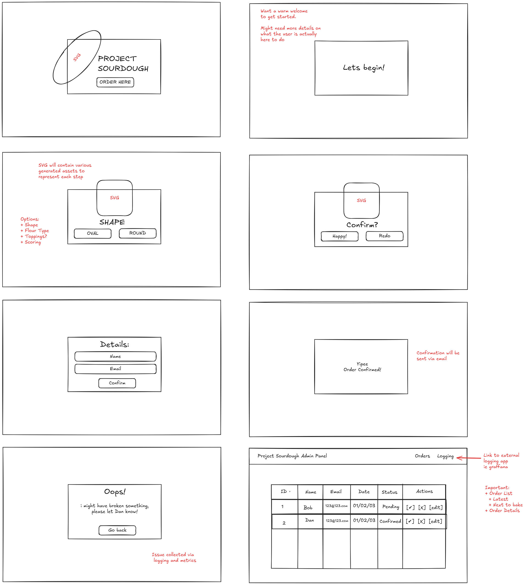

# Design Document

## Inspiration

While many modern bakeries lead into very minimalist, earthy-toned design, I
instead want to create a theme that makes use of 1980's Memphis design. a very
nostalgic 80s aesthetic that makes use of pastel color, beyond the modern
earthy tones.

- [KUDO Bakery](https://kudobakery.com.au/) - a Melbourne based bakery which
  uses very minimal earthy pastel design.
- [Baker Blue](https://bakerbleu.com.au/) - a very modern minimalistic design,
  great use of contrast and typography.
- [DROM](https://www.drom.melbourne/)
- [Memphis.it](https://memphis.it/en/) - Provides a great outline on memphis design.
- [80s Retro Album Cover](https://dribbble.com/shots/22497310-Album-Cover-Memphis-Design-80s-Retro)
- [Memphis Website Concept](https://www.behance.net/gallery/190778935/Memphis-Website-concept-2023?tracking_source=search_projects|memphis+design&l=3#)

## Typography

- Primary font: [Outfit](https://fonts.google.com/specimen/Outfit)

## Color Palette

| Use | Hex |
|---|---|
| Background | #FFF5E1 |
| Text (dark) | #333333 |
| Text (light) | #FAFAFA |
| Color #1 (Pink) | #FF6F91 |
| Color #2 (Blue) | #4D9DE0 |
| Color #3 (Yellow) | #FFE156 |
| Color #3 (Green) | #A0E8AF |
| Color #3 (Purple) | #8E6EC2 |

## Wireframes

The wireframe design files can be found in `/docs/wireframes.excalidraw`. These
sketches outline the core layout for:
- home screen
- sourdough customization form
- order confirmation page
- admin dashboard
